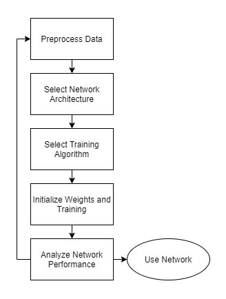
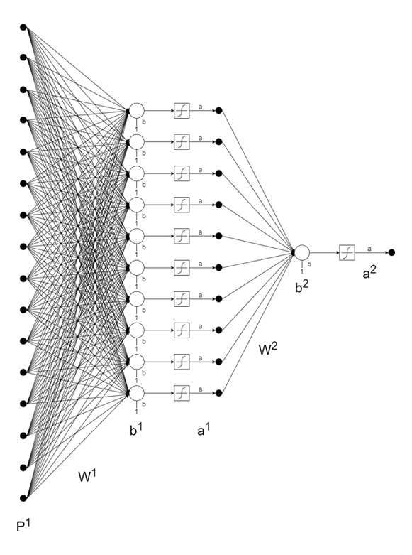
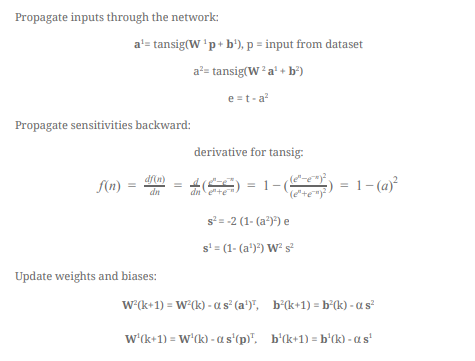
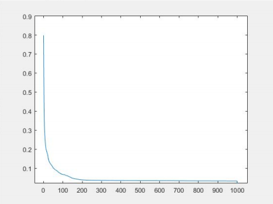
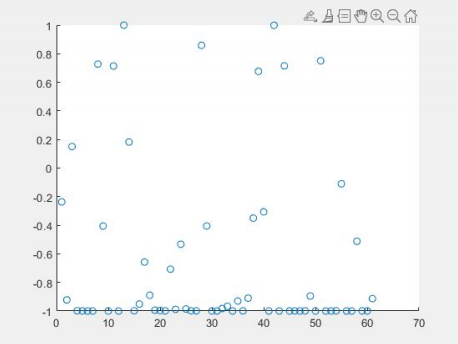
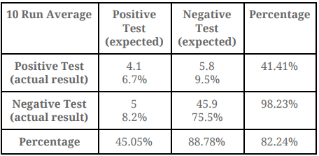

# ENEL 525 - Final Project
Winter 2020 - [Final Report](https://github.com/jthnl/LearningML/blob/main/525FinalReport.pdf)

# Introduction
The main goal for this project is to design and train a neural network that can identify patients with SARS-CoV-2. For this project, we were given a training dataset with the patient's age, SARS-CoV-2 test result, and other blood markers. The dataset had 598 data points overall. Among these 598 data points, 81 had positive SARS-CoV-2 test results.

**Table 1: Training Dataset**

Column | Description | Data type
------------ | ------------- | -------------
0 | Row index (corresponding to the original file). The samples containing NaN/missing data are removed, so there are 598 individuals with full blood counts. | Integer
1 | age (percentile group) | Continuous
2 | rt-PCR SARS-CoV- 2 test | Discrete Class [Positive, Negative]
3 | hematocrit | Continuous
4 | haemoglobin | Continuous
5 | platelets | Continuous
6 | mean platelet volume (MPV), | Continuous
7 | red blood cells (RBC), | Continuous
8 | lymphocytes | Continuous
9 | mean corpuscular haemoglobin concentration (MCHC) | Continuous
10 | leukocytes | Continuous
11 | basophils | Continuous
12 | mean corpuscular haemoglobin (MCH) | Continuous
13 | eosinophils | Continuous
14 | mean corpuscular volume (MCV) | Continuous
15 | monocytes | Continuous
16 | red blood cell distribution width (RBCDW). | Continuous

# Methodology
Summarized from the [Final Report](https://github.com/jthnl/LearningML/blob/main/525FinalReport.pdf)

**Figure 1: Strategy [1]**

**Figure 2: Network Architecture [2][3]**

**Figure 3: Learning Rule Derivation[3]**

**Table 2: Initial Values**
Variables | Value
------------ | -------------
Alpha | 0.01
Error Threshold | 0.00002
Iterations (Epochs) | 1000x
Weights | randomized
Train:Test Ratio | 90%:10%
Training Data (adjusted) | 969 - (456 : 504)
Training Attempts | average of 10x
Test Data | 61 total - (52:9 split)

# Results
**Figure 4: Mean Squared Error vs Epochs**

**Figure 5: Test Data (1 - COVID positive, -1 COVID negative)**

**Figure 6: Results - Confusion Table**

# Conclusion
The goal was to create a neural network to identify patients with SARS-CoV-2  based on blood markers. To train the network, a dataset with 598 data points was provided. Among which, 81 data points had positive SARS-CoV-2 test results.

First, the data was preprocessed. Some columns were removed, some were normalized, and others were modified. Additionally, the dataset was split into training and testing data (90% : 10%). Since there were more negative test results than positive test results, the positive test results were duplicated to train the network evenly. [2]

A 2-layer tansig-tansig network was chosen for the final network design. This decision was based on the input provided and information from the textbook [2]. In order to determine the number of nodes for the hidden layer, multiple values were tested with different iteration attempts. Ultimately, a 10-node network was used for the final network design. The system proved to be powerful enough to classify the inputs while having a short training period (~1000 epochs). With the network design determined, 10 randomized training sets were ran with the provided data. The network achieved adequate results.

Overall, the network was able to correctly identify 82.24% of the results. It was able to identify most of the negative test cases (98%). However, it struggled to identify positive test cases (45%). 

Some improvement ideas were identified for future iterations. First, more data should be collected. This would help the overall training process and produce results with a higher accuracy. Next, the design of the neural network should be reconsidered (layers, activation function, and number of nodes). Finally, the evaluation methods should also be analyzed as part of the iterative improvement strategy.

# References
[1] M. Hagan, H. Demuth, M. Beale and O. De Jesús, Neural network design. [S. l.: s. n.], 2016. Chapter 22

[2] M. Hagan, H. Demuth, M. Beale and O. De Jesús, Neural network design. [S. l.: s. n.], 2016. Chapter 25

[3] M. Hagan, H. Demuth, M. Beale and O. De Jesús, Neural network design. [S. l.: s. n.], 2016. Chapter 14